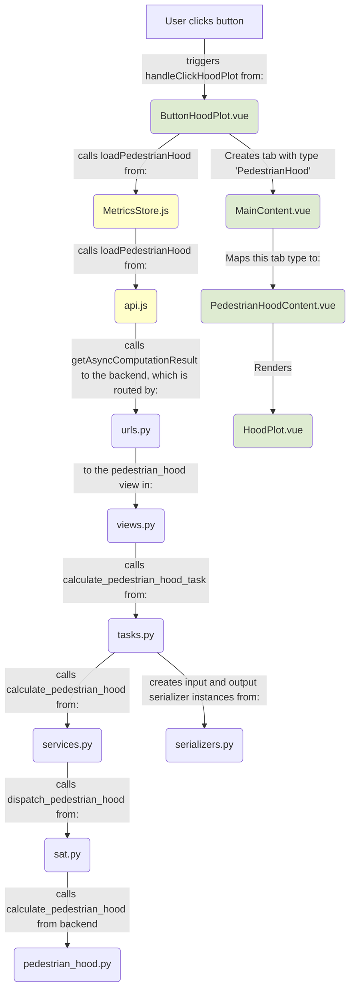

```mermaid
flowchart TD
    A[User clicks button] -->|triggers handleClickHoodPlot from:| bhp(ButtonHoodPlot.vue)
    bhp -->|calls loadPedestrianHood from:| ms(MetricsStore.js)
    ms -->|calls loadPedestrianHood from:| api(api.js)
    api -->|calls getAsyncComputationResult to the backend, which is routed by:| url(urls.py)
    url -->|to the pedestrian_hood view in:| views(views.py)
    views -->|calls calculate_pedestrian_hood_task from:| tasks(tasks.py)
    tasks -->|calls calculate_pedestrian_hood from:| services(services.py)
    tasks -->|creates input and output serializer instances from:| serializers(serializers.py)
    services -->|calls dispatch_pedestrian_hood from:| sat(sat.py)
    sat -->|calls calculate_pedestrian_hood from backend| ph(pedestrian_hood.py)
    bhp -->|Creates tab with type 'PedestrianHood'| mc(MainContent.vue)
    mc -->|Maps this tab type to:| phc(PedestrianHoodContent.vue)
    phc -->|Renders| hp(HoodPlot.vue)
    

    classDef yellowNode fill:#fffeca
    classDef greenNode fill:#deebd1
    class ms,api yellowNode
    class bhp,mc,phc,hp greenNode
```

