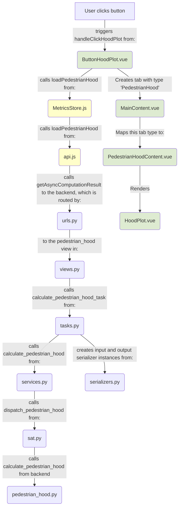

In the summer of 2025, I worked with Wake Forest University School of Medicine [Center for Injury Biomechanics](https://school.wakehealth.edu/departments/biomedical-engineering/center-for-injury-biomechanics) under Dr. Scott Gayzik and in collaboration with [Elemance](https://www.elemance.com/) on a novel web based signal analysis tool for vehicle safety testing.

<!--more-->

## Overview
Newly developed vehicles must undergo and pass a series of rigorous testing procedures to comply with the Federal Motor Vehicle Safety Standards (FMVSS). The National Highway Traffic Safety Administration (NHTSA) is responsible for verifying results and approving vehicles to ensure public safety. As part of this mission, NHTSA is developing a web-based platform for industry and govenment professionals titled WebSAT, for efficient visualization and analysis of vehicle safety testing data.

My project contributed to WebSAT by building a "Hood Top Visualizer"—a component in the website that graphically displays the top surface of a vehicle's hood along with overlaid pedestrian safety test data. These tests evaluate the potential injury outcomes for pedestrians in the event of a collision, making spatial representation of impact zones and injury metrics crucial for interpreting results. The visualizer plots relevant testing metrics such as Head Injury Criterion (HIC) scores at specified impact locations, enabling engineers and analysts to assess vehicle compliance at a glance.

## Project Architecture
The WebSAT project used a containerized architechture with four key tools:

## Implementation
At a high level, my implemetation comprised a "Hood Plot" button and an API call cascade: 

The end result would include a dynamically generated plot similar to this example, containing line landmarks, area landmarks, and impact landmarks:

<!-- Load Plotly.js -->

<!-- Container for the plot -->

<!-- Load our custom script -->


